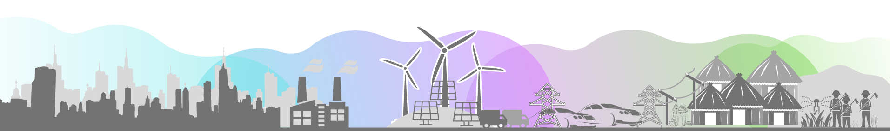

### Study projects

I undertook following projects as part of my Msc. in Engineering and Policy Analysis at TU Delft.

* #### [Master's thesis project - Modelling Dutch energy communities](http://sonianmol.com/Modelling-Dutch-Energy-Communities/)

* #### Others

  * [QCONNECT: An agent based model for studying adoption of circular economy in Dutch automotive industry](https://github.com/max-reddel/QONNECT)
  * [Geothermal integration in the future Waalhaven area of Rotterdam: Joint interdisciplinary project](https://drive.google.com/uc?export=view&id=129mb_gFJ-hzAdi-LygNL6DOWviL4eE31)
  * [Modelling agent based behaviour for evacuation under emergency response.](https://github.com/EliasBach/ABM_Project_Q1)

    (more projects to be added soon)

 
 
 
 

